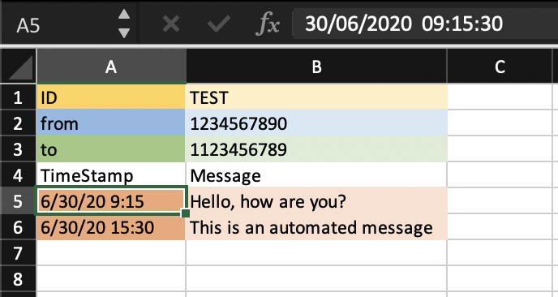

# Twilio Scheduler #
## Purpose
This script schedules sending out SMS messages via Twilio. Scheduling information is read in from a spreadsheet and scheduling itself is handled via crontab.

## Arguments
The script takes in four positional arguments:
1. A _path to a spreadsheet_ with information on the sending and receiving phone number, date and time stamps for each message, and the message itself (see below for more information about the format). 
2. A _path to an output folder_ where the mesages will be stored.
3. Your Twilio _account SID_ (account string identifier).
4. Your Twilio _authentication token_.
  

## Spreadsheet format
An example spreadsheet is avaulable under see *./example_sheet/example_input.xlsx*. 

The first four lines of the spreadsheet are reserved for a message ID (ID), the sender number (from), the receiver number (to), and headers for the remaining data lines. For these first four lines, you only need to edit information in column B, row 1-3.

Line 5 and 6 in the example are data lines. Column A shows the date and time stamp that should be entered in the format: 'DD/MM/YYYY HH:MM:SS'. Column B is where you enter the text message.

## Notes
Messages to be send are written out to specified output folder. After these messages are sent, the will *not* be removed. After a message is sent, the crontab entry for this message *will* be removed.

## Known Bugs
On OSX Mojave, crontab jobs are not autmatically removed because of privilege limitations. You can manually edit your crontab file using `crontab -e` in a terminal.
